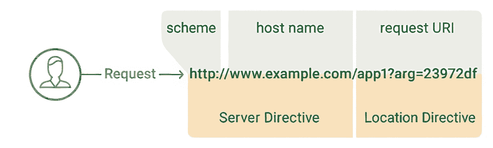

# Serveur web

Dans NGINX, toute configuration de serveur web passe par le contexte `server` définissant un bloc de configuration pour le dit serveur.

## La directive `listen`

La directive `listen` sert à définir une adresse IP et/ou port d'écoute pour le serveur virtuel défini dans le bloc. La syntaxe est la suivante : 

```shell
server {
  listen <ADRESSE>:<PORT> [<OPTIONS>];
}
```

Ici : 

- `<ADRESSE>` est l'adresse IP sur laquelle le serveur écoutera. Cela peut être des IPv4 ou bien IPv6 avec la syntaxe `[::]` ou bien toutes les adresses avec `*`
- `<PORT>` est le port sur lequel le serveur écoutera
- `<OPTIONS>` : Parmi les options, on a `default_server` qui désigne le serveur comme celui par défaut sur l'adresse et le port configurés.

## La directive `server_name`

Il peut arriver que plusieurs serveurs virtuels aient la même configuration d'écoute. Pour les différencier, NGINX utilise le header `Host` de la requête entrante pour sélectionner le
bon serveur. La valeur de ce header devra matcher avec celle de la directive `server_name`. La valeur de `server_name` peut être un nom de domaine complet (par ex `google.fr`), une string
spécifique (utilisant `*` pour matcher des sous-domaines par ex) ou une expression régulière. Si toutefois, plusieurs configs matchent le Host, NGINX va trancher dans l'ordre suivant : 

1. Nom de domaine complet
2. String générique commençant par `*`
3. String générique se terminant par `*`
4. Première expression régulière matchée
5. Si pas de correspondance, le serveur par défaut correspondant au port sera sélectionné.

Exemple d'utilisation

```shell
server {
    listen 80;
    server_name ~^mydomain\.(com|fr|eu)$;
}
```

Dans cet exemple, les domaines sélectionnés sont `mydomain.com`, `mydomain.fr` et `mydomain.eu`.

### Le joker

On peut utiliser un joker dans un `server_name` pour matcher tous les sous-domaines de `mydomain.fr` en mettant un `.` devant : 

```shell
server {
    listen 80;
    server_name .mydomain.fr;
}
```

### Le serveur catch-all

Il est courant de définir un serveur par défaut pour tout ce qui n'a pas matché une config `server_name` comme suit : 

```shell
server {
    listen 80 default_server;
    server_name _;
    return 444;
}
```

Remarques : 

- L'option `default_server` est utilisée pour définir ce serveur comme étant celui par défaut
- L'utilisation de `_` comme valeur de `server_name` signifie que le serveur ne doit pas matcher un domaine. La combinaison avec `default_server` permet au serveur de traiter toutes les requêtes n'ayant pas matché.
- La directive `return` permet de retourner un statut HTTP `444`, ce qui revient à n'envoyer aucune réponse au client et fermer la connexion.

## La directive `location`

La directive `location` sert à définir une configuration spécialement pour une ressource du serveur virtuel. Cela implique toute la partie de l'URI qui suit le domaine,
selon le schéma suivant : 



Syntaxe : 

```shell
server {
  location [<MODIFICATEUR>] /<SUB_URL>/ {
    # ... Configuration pour cette ressource ou ce chemin spécifique
  }
}
```

Ici le modificateur sert à définir un mode de match de l'URI de la ressource : 

- `=` : correspondance exacte
- `^~` : correspondance préfixe préférée. S'il n'y a pas de correspondance exacte, NGINX va chercher une correspondance du préfixe
- `~` : correspondace de regexp sensible à la casse.
- `~*` : correspondance de regexp insensible à la casse

Exemple d'utilisation : 

```shell
server {
    listen 80;
    server_name mywebsite.fr;

    location = / {
        # Configuration spécifique pour la page d'accueil
    }

    location ^~ /assets/ {
        # Configuration pour les fichiers d'assets (images, CSS, JS)
    }

    location /api/ {
        # Configuration spécifique pour l'API
    }

    location ~* ^/downloads/(.+\.(?:pdf|zip|docx?))$ {
        # Configuration spécifique pour les fichiers téléchargeables (PDF, ZIP, DOC, DOCX)
    }

    location ~ /private/ {
        # Configuration pour les fichiers privés
    }

    location / {
        # Configuration pour les autres requêtes
    }
}
```

## La directive `root`

La directive `root` sert à indiquer l'emplacement des fichiers à servir pour les clients. Elle peut être utilisée au sein des contextes `http`, `server` ou `location`. Quand une requête
est traitée par NGINX, ce dernier concatène l'URI du serveur avec la valeur de `root` pour oobtenir le path du fichier à servir.

> La valeur de `root` doit être soit un path absolu, soit un path relatif par rapport au path de la config de NGINX.

> Si des valeurs sont définies à la fois dans un bloc `location` et son bloc parent `server`, `location` aura la priorité.

Exemple d'utilisation : 

```shell
server {
    listen 80;
    server_name mywebsite.fr;

    root /var/www/mywebsite.fr;
}
```

Dans cet exemple, une requête sur l'URI `http://mywebsite.fr/index.html` aura pour réponse le fichier `/var/www/mywebsite.fr/index.html`

## La directive `index`

La directive `index` sert à définir le fichier qui servira de point d'entrée pour les requêtes entrantes pointant sur un répertoire.

Exemple d'utilisation : 

```shell
server {
    listen 80;
    server_name mywebsite.fr;

    root /var/www/mywebsite.fr;
    index index.html;
}
```

Dans cet exemple, lors d'une requête sur `http://mywebsite.fr`, NGINX servira le fichier `/var/www/mywebsite.fr/index.html`.

## La directive `try_files`

La directive `try_files` permet de spécifier une liste de fichiers que NGINX devra trouver pour ensuite le servir au client.

Exemple d'utilisation : 

```shell
server {
    listen 80;
    server_name mywebsite.fr;

    root /var/www/mywebsite.fr;
    index index.html;

    location / {
        try_files $uri $uri/ =404;
    }
}
```

Dans cet exemple, lors de chaque requête, NGINX vérifie si le fichier demandé dans l'URL est disponible (ici `$uri`). Si le fichier n'existe pas, NGINX se met à chercher un dossier (`$uri/`)
Enfin, si il n'y a aucun match, NGINX renvoie un statut 404.


## La directive `return`

La directive `return` sert à retourner une réponse HTTP au client. Elle est utilisable dans les contextes `server` et `location`. La syntaxe est la suivante : 

```shell
return <STATUS_CODE> [<TEXTE?>|<URL?>];
```

Ici : 

- `<TEXTE>` : Texte qui sera dans le body de la réponse
- `<URL>` : URL pour une redirection

Exemple d'utilisation pour une redirection vers notre nouveau site : 

```shell
server {
    listen 80;
    server_name mywebsite.fr;
    location /old-uri {
        return 301 /new-uri;
    }
}
```

Exemple pour forcer le protocole HTTP : 

```shell
server {
    listen 80;
    server_name mywebsite.fr;
    return 301 https://$host$request_uri;
}
```

## La directive `rewrite`

La directive `rewrite` est utilisée pour réécrire l'URI de la requête qui sera traitée ensuite par NGINX. La syntaxe est la suivante : 

```shell
rewrite <URI_MATCH_REGEXP> <SUBSTITUTE_URI> <OPTIONS>;
```

Ici : 

- `<URI_MATCH_REGEXP` : Regexp pour matcher l'URI entrante
- `<SUBSTITUTE_URI` : URI à substituer à l'URI matchée
- `OPTIONS` : Options de traitement de la requête

Parmi les options de traitement on a : 

- `last` stoppe le traitement des directives `rewrite` et lance une recherche de l'emplacement correspondant à la nouvelle URI.
- `break` stoppe le traitement des directives `rewrite`
- `redirect` renvoie une redirection temporaire (302)
- `permanent` renvoie une redirection permanente (301)

## La directive `error_page`

La directive `error_page` sert à définir un comportement à adopter en cas d'erreur pour NGINX suivant le code erreur. Elle est utilisable dans les contextes `http`, `server` et `location`.
La syntaxe est la suivante : 

```shell
error_page <STATUS_CODE> ... [= <RES_CODE?>] <PAGE_URI>;
```

Ici : 

- `<STATUS_CODE>` : code statut pour lequel on souhaite un comportement
- `<RES_CODE>` : code statut à renvoyer (facultatif)
- `<PAGE_URI>` : URI de la page d'erreur à servir

Exemple d'utilisation : 

```shell
error_page 404 /custom_404_page.html;
error_page 500 502 503 504 /custom_50x_page.html;
```

## Les variables

On peut définir des variables custom dans la config de NGINX : 

```shell
set $<VARIABLE> "<VALUE>";
```

que l'on peut ensuite lire : 

```shell
$<VARIABLE>
```

NGINX met à disposition des variables pré-définies ([Liste](https://nginx.org/en/docs/varindex.html)). Parmi les plus connues : 

- `$host` : nom de domaine requêté par le client
- `$uri` : URI de la requête sans les arguments (querystrings & params)
- `$request_uri` : URI complète de la requête
- `$args` : Arguments de la requête (querystrings et params)
- `$request_method` : méthode HTTP de la requête
- `$http_<HEADER>` : Header de la requête
- `$request_time` : Temps de traitement de la requête
- `$request_length` : Taille de la requête
- `$status` : Code status de la réponse

Exemple d'utilisation : 

```shell
events {
}

http {
	charset utf-8;

	server {
		listen 80;
		server_name localhost;

		set $foo "Hello World";
		set $baz "Hello World again !";

		location /variables {
			return 200 "
				==== Variables natives de NGINX ====
				HOST: $host
				URI: $uri
				QUERY_STRING: $query_string
				REQUEST_METHOD: $request_method
				REQUEST_URI: $request_uri
				DOCUMENT_URI: $document_uri
				DOCUMENT_ROOT: $document_root
				SERVER_PROTOCOL: $server_protocol
				REQUEST_SCHEME: $scheme
				REMOTE_ADDR: $remote_addr
				SERVER_ADDR: $server_addr
				SERVER_PORT: $server_port
				SERVER_NAME: $server_name
				HTTP_HOST: $http_host
				HTTP_USER_AGENT: $http_user_agent
				HTTP_ACCEPT: $http_accept
				HTTP_ACCEPT_LANGUAGE: $http_accept_language
				HTTP_ACCEPT_ENCODING: $http_accept_encoding
				HTTP_CONNECTION: $http_connection

				==== Variables custom ====
				FOO: $bar
				BAZ: $baz
			";
		}
	}
}
```

## Cas pratiques

### Servir un site statique

Fichier `Dockerfile` : 

```dockerfile

FROM nginx:alpine

# Copie du fichier de conf
COPY nginx.conf /etc/nginx/nginx.conf

# Copie des fichiers de notre site
COPY html /usr/share/nginx/html
```

Le fichier `nginx.conf` en question : 

```shell
user nginx;
worker_processes auto;
error_log /var/log/nginx/error.log warn;
pid /var/run/nginx.pid;

events {
}

http {
    default_type application/octet-stream;
    include /etc/nginx/mime.types;

    server {
        listen 80;
        server_name localhost;

        location / {
            root /usr/share/nginx/html;
            index index.html;
            try_files $uri $uri/ $uri.html;
        }
    }
}
```

Remarques : 

- La directive globale `error_log` définit l'emplacement des logs d'erreurs de NGINX.
- Le `default_type` setté à `application/octet-stream` définit le type MIME des fichiers à servir. Tout fichier non connu doit être associé à ce type.
- Les types MIME de NGINX sont inclus avec la directive `include`
- L'utilisation de `try_files` permet de servir la page correspondante à l'URI requêtée.

### Servir une SPA

Pour servir une __Single Page Application__ (React, Angular ou autre framework/librairie) : 

```dockerfile
# Phase de build de l'app
FROM node:lts as build

WORKDIR /app

COPY package*.json ./

RUN npm install

COPY . .

RUN npm run build

# Phase de mise en prod
FROM nginx:stable-alpine

# Copier le fichier distribué dans NGINX
COPY --from=build /app/build /usr/share/nginx/html

# Copier la configuration de NGINX
COPY ../nginx.conf /etc/nginx/nginx.conf

# Exposer le port 80
EXPOSE 80
```

Configuration de NGINX : 

```shell
user nginx;
worker_processes auto;
error_log /var/log/nginx/error.log warn;
pid /var/run/nginx.pid;

events {
}

http {
    default_type application/octet-stream;
    include /etc/nginx/mime.types;

    server {
        listen 80;
        server_name localhost;

        location / {
            root /usr/share/nginx/html;
            index index.html;
            try_files $uri /index.html;
        }
    }
}
```

Remarques : 

- `try_files` pointe sur le fichier `index.html` puisqu'il n'y a qu'un seul point d'entrée dans une SPA.